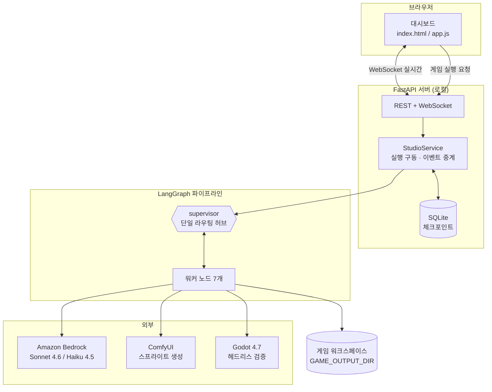
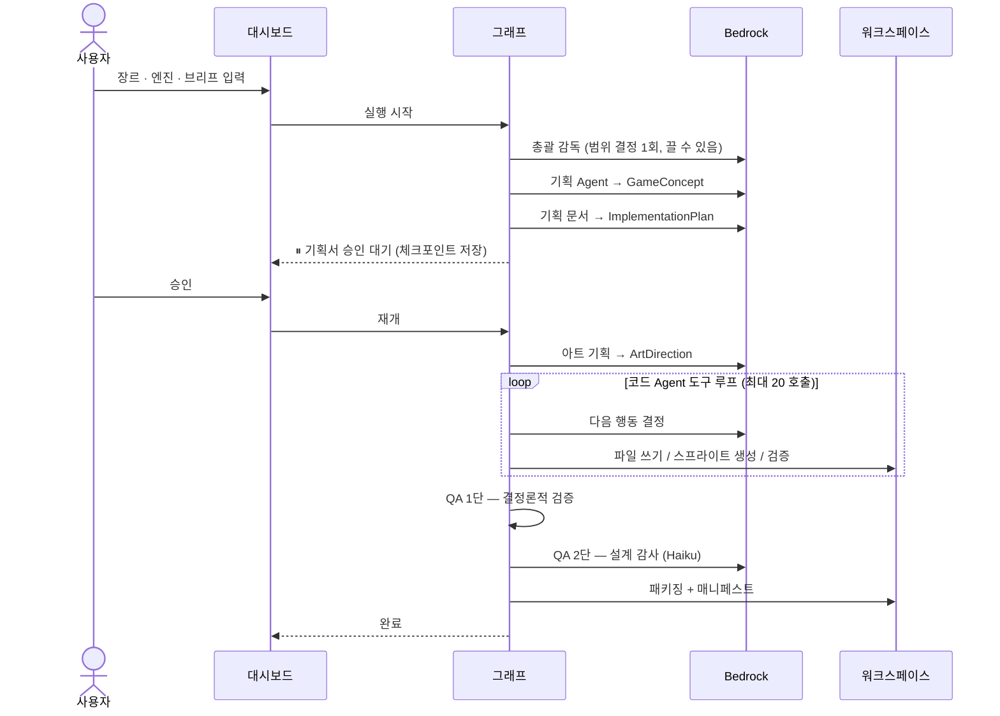
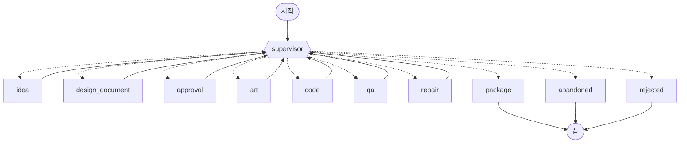
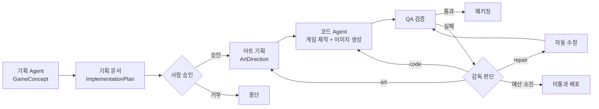
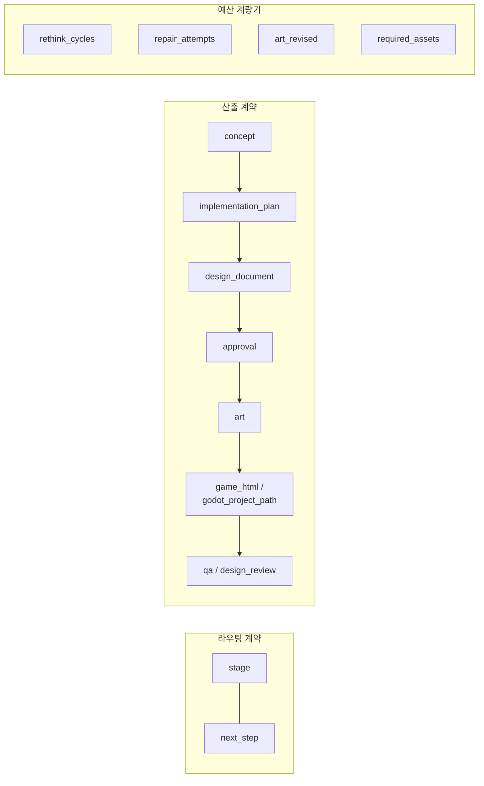
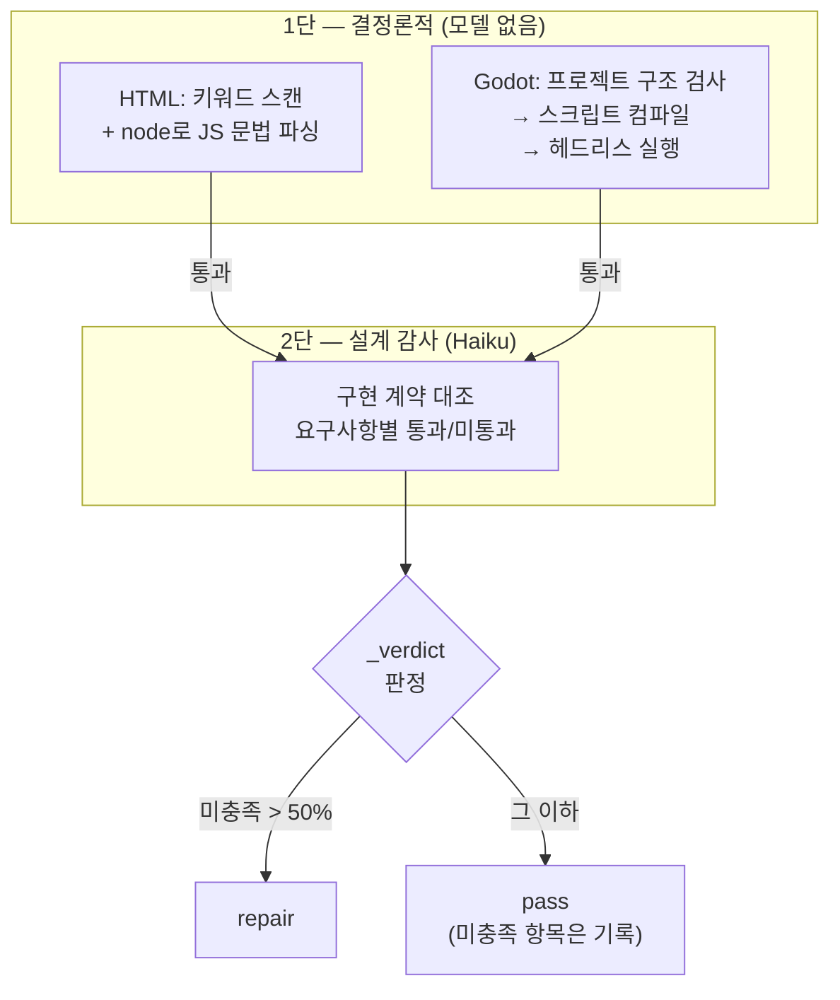
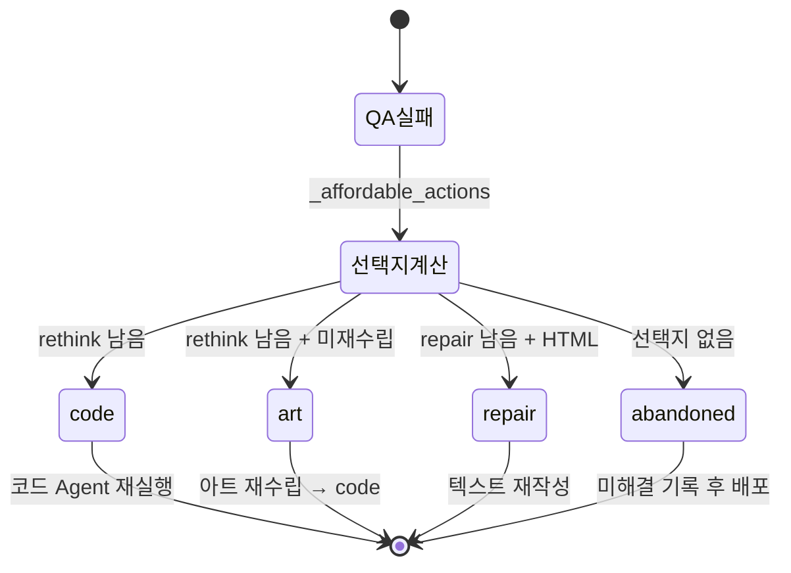
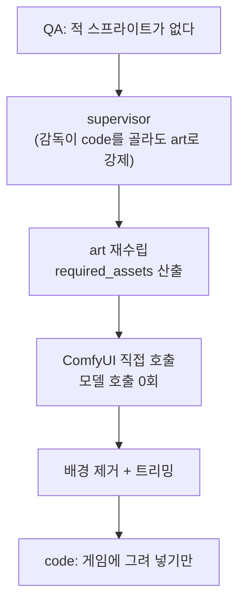
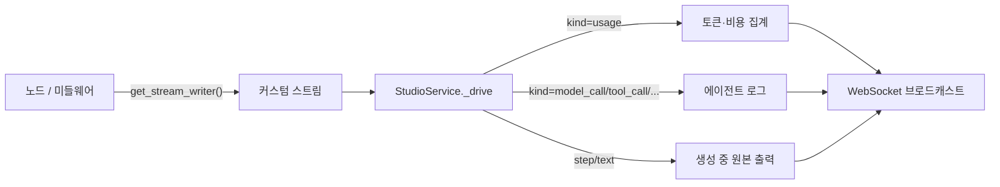

# 아키텍처

사람이 기획서를 승인하면, 여러 AI 에이전트가 실제로 플레이 가능한 게임을 만들어 내는 파이프라인.
HTML5 Canvas 단일 파일 또는 Godot 4 프로젝트 중 하나로 산출한다.

- **모듈별 상세** → [MODULES.md](MODULES.md)
- **왜 이렇게 설계했는가** → [DESIGN-DECISIONS.md](DESIGN-DECISIONS.md)

---

## 1. 무엇을 만드는 시스템인가

한 번의 실행(run)은 이렇게 끝난다.

| 엔진 | 산출물 | 검증 방식 |
|---|---|---|
| `html5` | `index.html` 한 장 (외부 의존성 0) | 키워드 스캔 + JS 문법 파싱 |
| `godot` | Godot 4 프로젝트 + `run.bat` (+ 가능하면 웹 빌드) | **엔진이 실제로 실행** |

두 경로는 **기획 단계를 전부 공유**하고, 산출물이 달라지는 세 단계(코드·검증·패키징)에서만 갈라진다.

### 설계의 중심 원칙 세 가지

**1. 사람의 승인이 진짜 게이트다.**
기획서가 나오면 그래프가 멈춘다(`interrupt()`). 승인 없이는 아트도 코드도 시작하지 않는다.
이 대기는 SQLite 체크포인트에 저장되므로 대시보드를 재시작해도 살아남는다.

**2. 판단이 필요한 곳에만 모델을 쓴다.**
supervisor는 8번 방문에 모델 호출 1번이다. 나머지는 딕셔너리 조회다.

**3. 검증은 막을 수 있는 것만 막는다.**
게임이 동작하지 않게 만드는 것만 차단하고, 나머지는 기록만 남긴다.
"멀쩡한 게임을 QA가 떨어뜨려 예산을 태우는" 실패를 여러 번 겪고 나온 원칙이다.

---

## 2. 전체 구조



### 실행 흐름 (정상 경로)



---

## 3. 그래프 토폴로지

실제 컴파일된 그래프를 그대로 옮긴 것이다 (`build_graph().get_graph().draw_mermaid()`).



**허브-스포크 구조다.** 모든 워커가 supervisor로 돌아오고, 간선을 고르는 곳은 supervisor 하나뿐이다.
이건 supervisor 패턴이 맞다 — 다만 **라우팅을 LLM이 아니라 코드가 결정한다**는 점이 `create_supervisor` 같은
라이브러리 구현과 다르다. 이유는 [DESIGN-DECISIONS.md §1](DESIGN-DECISIONS.md#1-supervisor-패턴을-직접-구현한-이유)에 있다.

### supervisor가 실제로 판단하는 것

| 진입 상황 | 동작 | 모델 호출 |
|---|---|---|
| 첫 방문 | 총괄 감독이 프로덕션 브리프 작성 | **있음** |
| `stage == approval` | 사람의 결정을 그대로 분기 | 없음 |
| `stage == qa` + 통과 | package로 | 없음 |
| `stage == qa` + 실패 | `_escalate` — 다음 조치 결정 | **있음** |
| 그 외 전부 | `_NEXT_AFTER[stage]` 조회 | 없음 |

실측: supervisor 방문 8회 중 모델 호출 1회. (+ QA 실패 시 1회)

---

## 4. 파이프라인 단계



### 단계별 모델 사용

| 단계 | 모델 | 출력 예산 | 호출 |
|---|---|---|---|
| 총괄 감독 | Sonnet 4.6 | 1,024 | 런당 1회 · 기본 꺼짐 (`DIRECTOR_TIMEOUT_SECONDS=0`) |
| 기획 Agent | Sonnet 4.6 | 8,000 | 1회 |
| 기획 문서 | Sonnet 4.6 | 8,000 | 1회 |
| 아트 기획 | Sonnet 4.6 | 8,000 | 1회 (+ 재수립 1회) |
| **코드 Agent** | Sonnet 4.6 | 16,000 | **최대 20회** |
| QA 설계 감사 | **Haiku 4.5** | 12,000 | 정적 검증 통과 시 |
| 감독 에스컬레이션 | **Haiku 4.5** | 2,000 | QA 실패 시만 |
| 자동 수정 | Sonnet 4.6 | 16,000 | 감독이 선택 시만 (HTML 전용) |

시간·비용의 압도적 다수는 **코드 Agent**다. 나머지를 다 합쳐도 못 미친다.

---

## 5. 상태 모델

`StudioState`(TypedDict)가 노드 간 계약 전부다. 타입이 있는 Pydantic 객체를 그대로 주고받는다 —
메시지 문자열로 직렬화했다 재파싱하지 않는다.



**의도적으로 넣지 않는 것**: 코드 Agent의 대화 이력(`messages`).
읽는 곳이 없는데 게임 전체를 툴 인자로 품고 있어서, 체크포인트마다 재직렬화되고 rethink마다 누적됐다.

---

## 6. 검증 체계

같은 2단 구조를 두 엔진이 공유하되, 1단의 성격이 다르다.



**Godot이 질적으로 강하다.** HTML은 실행할 수 없는 게임을 키워드로 추측하지만,
Godot은 엔진이 실제로 돌려서 없는 노드·null 역참조를 **파일·줄 번호와 함께** 잡는다.

### 차단 기준

| | 차단 | 기록만 |
|---|---|---|
| HTML | canvas/루프/키입력 부재, 외부 의존성, JS 문법 오류, 불완전 HTML | 점수·재시작 미검출, 미사용 스프라이트 |
| Godot | main_scene 부재, `_process` 없음, 입력 처리 없음, 네트워크 API, 깨진 `res://` 경로 | WASD 미지원, 점수·재시작 미검출, 미사용 스프라이트 |
| 공통 | 계약의 50% 초과 미충족, 감사 결과 공백 | 그 이하 미충족, 리뷰어의 기타 지적(최대 5건) |

---

## 7. 에스컬레이션 예산

QA 실패 시 감독이 쓸 수 있는 수는 코드로 잘라낸다. 프롬프트로 부탁하지 않는다.



| 예산 | 기본값 | 비고 |
|---|---|---|
| `MAX_RETHINK_CYCLES` | 1 | 가장 비싼 수 — 코드 Agent 루프 전체 + 재감사 |
| `MAX_REPAIR_ATTEMPTS` | 1 | HTML 전용. Godot은 여러 파일이라 성립 안 함 |
| 아트 재수립 | 런당 1회 | `art_revised` 플래그 |

**Godot은 `repair`가 없어 실질 재시도가 rethink 1회뿐이다.** 부족하면 `MAX_RETHINK_CYCLES=2`.

---

## 8. 아트 파이프라인

`art` 노드는 **그림을 그리지 않는다.** 목록(`asset_plan`)만 쓴다. 실제 생성은 code가 한다 —
만들면서 무엇이 필요한지 발견하기 때문이다.

예외가 하나 있다. **재수립일 때는 art가 직접 생성한다.**



생성된 PNG는 세 가지 후처리를 거친다.

1. **크로마키 배경 제거** — 프롬프트가 초록 배경을 요구하고, 색 판정 + 연결성으로 잘라낸다
2. **알파 바운딩박스 트리밍** — 640px 프레임 속 130px 차를 그대로 쓰면 자기 여백 안의 점이 된다
3. **방향 계약 기록** — `sprites.json`에 facing을 남겨 코드가 회전 보정각을 알 수 있게 한다

| `facing` | 생성 방향 | 게임에서 |
|---|---|---|
| `right` (기본) | +X | `ctx.rotate(Math.atan2(vy, vx))` |
| `up` | −Y | `ctx.rotate(Math.atan2(vy, vx) + Math.PI/2)` |
| `none` | 없음 | 회전 금지 |

---

## 9. 실시간 관측

대시보드는 "지금 누가 무슨 도구를 쓰는지"를 그대로 본다.



- 라이브 프리뷰는 **0.25초 타이머**로 만든다. 토큰마다 만들면 긴 생성이 자기 길이에 대해 2차가 된다.
- 브로드캐스트에서 `game_html`·`design_review`·`messages`는 뺀다. UI가 안 쓰는데 20KB+다.
- 비용 추정은 **캐시 읽기를 정가로 세지 않는다**(입력가의 1/10).

---

## 10. 측정과 관측

### 평가 하네스 — 프롬프트를 측정한다

`tests/`의 모든 테스트는 모델을 스텁 처리한다. 코드에는 맞는 선택이지만, 그래서 **프롬프트 자체는
측정되지 않는다** — 그리고 이 파이프라인의 동작 대부분은 프롬프트에 있다.

```bash
python -m game_studio.evaluate                            # 전체 (실제 비용 발생)
python -m game_studio.evaluate --case clone-tetris
python -m game_studio.evaluate --out evals/new.json --baseline evals/baseline.json
```

기획 단계만 돌린다(케이스당 모델 2회). 지표는 **거의 전부 결정론적**이다 — 판단이 필요한
"이게 정말 테트리스인가"는 구조적으로 답한다: 충실한 클론은 재현 대상을 `reference_games`에
적어야 하므로, 그 이름이 왔는지만 보면 된다.

| 지표 | 잡는 것 |
|---|---|
| `genre_kept` | 요청/배정 장르대로 나왔나 |
| `genre_assigned` | 자동 기획이 앵커 가능한 장르를 받았나 |
| `clone_named` | 재현 요청한 게임을 실제로 참조했나 |
| `has_references` | 검증된 루프에 앵커했나 |
| `contract_sized` | 코드 Agent 예산 안에 끝낼 계약인가 |
| 다양성 | 자동 기획 간 제목·코어 루프 중복도 |

### 트레이스

`@traceable`이 파이프라인 노드 11개 + **코드 Agent 내부**에 붙어 있다. 후자가 중요한데,
가장 비싼 단계(모델 호출 최대 20회)가 트레이스에서 노드 하나로 뭉쳐 보였기 때문이다.

| 스팬 | 기록 |
|---|---|
| `code-agent-turn` | 제공된 도구, 입출력 토큰, 캐시 읽기, stop reason |
| `code-agent-tool` | 도구 이름, 인자(200자 절단) |
| `structured-output` | 스키마·모델·예산, 재시도와 예산 증액 |

런 단위로 engine·모델·이미지 생성 여부가 메타데이터에 붙어 트레이스 목록에서 비교 가능하다.
게임 전문이 트레이스로 새지 않도록 입력은 전부 요약해서 기록한다.

`.env`에 `LANGSMITH_TRACING=true` + API 키만 넣으면 켜진다. 코드 변경은 필요 없다.

> `@traceable`은 비활성 상태에서도 호출당 약 37µs다(실측: 20k 호출 752ms vs 평범한 함수 2ms).
> 턴·도구 경계에는 무시할 수준이지만 **청크 단위 경로에는 절대 넣으면 안 된다** —
> `StreamAccumulator.add`는 게임 하나에 수천 번 호출된다.

---

## 11. 파일 지도

```
src/game_studio/
├── graph.py         1309  LangGraph 오케스트레이션 — 노드 · 라우팅 · 예산
├── agents.py              모델 어댑터 · 스트리밍 · 정적 QA · 장르 참조 · 총괄 감독
├── server.py         590  FastAPI 대시보드 — REST · WebSocket · 실행 구동
├── agent_tools.py    438  HTML 코드 Agent 도구 + ComfyUI 이미지 생성
├── godot.py          426  Godot 엔진 어댑터 — 검증 · 익스포트 · 런처
├── sprites.py        288  스프라이트 후처리 — 배경 제거 · 방향 계약
├── godot_tools.py    197  Godot 코드 Agent 도구
├── code_agent.py     287  create_agent 조립 — 예산 · 재시도 · 관측
├── prompts.py        354  역할별 시스템 프롬프트 · 장르 레퍼런스
├── models.py         212  Pydantic 스키마 + StudioState
├── cli.py            103  대시보드 없이 실행
├── required_art.py    101  필수 아트 판정 · 미사용 스프라이트 검출
└── comfyui.py         38  ComfyUI 워크플로 컴파일

tests/                3882  9개 파일 · 162개 테스트
web/                   467  대시보드 프론트엔드
```

---

## 12. 실행에 필요한 것

| 구성요소 | 필수 | 없으면 |
|---|---|---|
| Amazon Bedrock 자격증명 | **예** | 실행 자체가 거부됨 (503) |
| Node.js | 아니오 | JS 문법 검사만 건너뜀 |
| ComfyUI | 아니오 | Canvas 전용으로 제작 |
| Godot 4 | Godot 모드만 | 드롭다운에서 해당 옵션 비활성 |
| Godot 익스포트 템플릿 | 아니오 | 웹 빌드 없이 `run.bat`으로 실행 |
| Pillow | 아니오 | 스프라이트가 불투명 사각형으로 남음 |

**"없으면 조용히 통과"는 없다.** 전부 명시적으로 보고한다.

---

## 13. 주요 설정

`.env`로 전부 조절 가능하다. 자주 만지는 것만 추림.

```bash
# 모델
BEDROCK_MODEL_ID=global.anthropic.claude-sonnet-4-6            # 기획·코딩
BEDROCK_QA_MODEL_ID=global.anthropic.claude-haiku-4-5-...      # 검증·판단

# QA 강도
QA_REJECT_TOLERANCE=0.5        # 계약의 이 비율을 넘게 미충족해야 차단
MAX_RETHINK_CYCLES=1           # 가장 비싼 손잡이
MAX_REPAIR_ATTEMPTS=1
ADVISORY_FINDING_LIMIT=5

# 코드 Agent
CODE_AGENT_MODEL_CALLS=20

# 비용
BEDROCK_PROMPT_CACHE_TTL=5m    # off 로 끌 수 있음
COMFYUI_MAX_ASSETS=8

# 지속성
CHECKPOINT_DB=<GAME_OUTPUT_DIR>/studio-checkpoints.sqlite      # :memory: 로 옵트아웃
```

전체 목록은 `.env` 주석에 있다.
